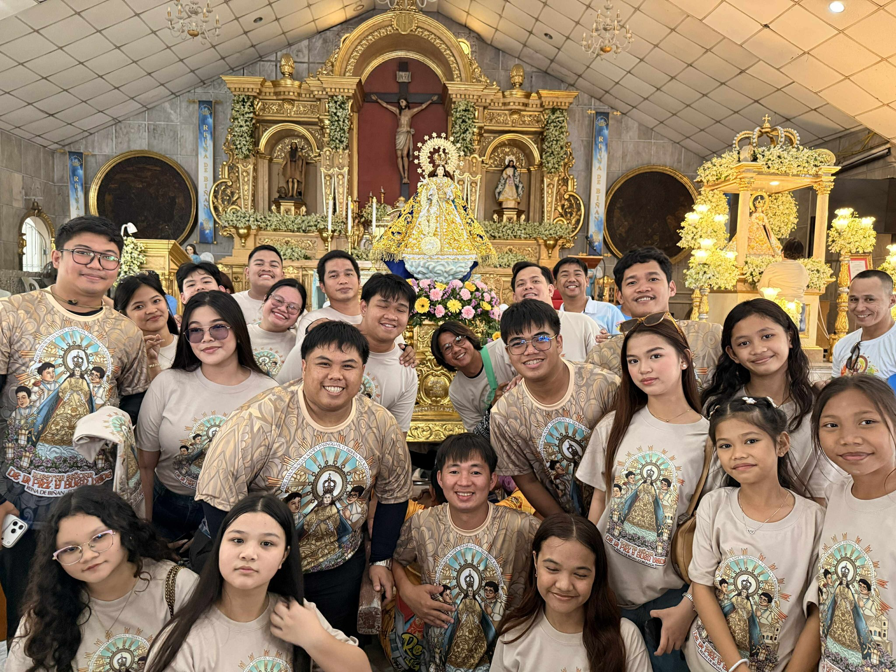

<!DOCTYPE html>
<html lang="tl">
<head>
    <meta charset="UTF-8">
    <meta name="viewport" content="width=device-width, initial-scale=1.0">
    <title>Queen of Biñan Choir | Nuestra Señora De La Paz Buen Viaje</title>
    
    
    <link href="https://cdnjs.cloudflare.com/ajax/libs/font-awesome/6.0.0/css/all.min.css" rel="stylesheet">
    <link href="https://unpkg.com/aos@2.3.1/dist/aos.css" rel="stylesheet">
    
    <link href="https://fonts.googleapis.com/css2?family=Cinzel:wght@400;700;900&family=Quicksand:wght@300;500;700&family=Great+Vibes&display=swap" rel="stylesheet">

    
</head>
<body class="bg-white text-slate-900">

    <nav class="fixed w-full z-[100] px-4 md:px-12 py-6">
        

            

                

                    <i class="fa-solid fa-crown text-yellow-400 text-xl"></i>
                

                Queen of Biñan Choir
            

            
            

                <a href="#home" class="hover:text-amber-600 transition duration-300">Home</a>
                <a href="#vision" class="hover:text-amber-600 transition duration-300">Misyon</a>
                <a href="#history" class="hover:text-amber-600 transition duration-300">Kasaysayan</a>
                <a href="#gallery" class="hover:text-amber-600 transition duration-300">Gallery</a>
                <a href="#contact" class="hover:text-amber-600 transition duration-300">Contact</a>
            

            

                <a href="https://www.facebook.com/profile.php?id=100089772245400" target="_blank" class="text-blue-900 hover:text-amber-600 transition text-xl">
                    <i class="fa-brands fa-facebook"></i>
                </a>
                <button class="md:hidden text-blue-900 text-xl"><i class="fa-solid fa-bars"></i></button>
            

        

    </nav>

    <section id="home" class="hero-gradient min-h-screen flex items-center justify-center text-white overflow-hidden relative pt-20">
        

        
        <i class="fa-solid fa-music absolute top-40 left-10 text-white/5 text-[150px] floating-icon"></i>
        <i class="fa-solid fa-star absolute bottom-40 right-10 text-yellow-400/10 text-[120px] floating-icon" style="animation-delay: 2s;"></i>

        

            

                

                    

                    

                        

                            
                        

                    

                    

                        <i class="fa-solid fa-crown text-xl"></i>
                    

                

            

            AVE MARIA PURISIMA • SIN PECADO CONCEBIDA 
            
            <h1 class="font-cinzel text-5xl md:text-8xl font-black mb-4 leading-tight tracking-tight">
                QUEEN OF BIÑAN  CHOIR
            </h1>
            
            <h2 class="font-cursive text-4xl md:text-6xl text-blue-100 mb-12 drop-shadow-md">
                Nuestra Señora De La Paz y Buen Viaje
            </h2>
            
            

                <a href="#gallery" class="btn-shine bg-amber-500 text-blue-950 px-14 py-5 rounded-full font-black text-sm uppercase tracking-[0.2em] shadow-xl">
                    Mag-alay ng Himig
                </a>
                <a href="#history" class="group flex items-center gap-3 font-bold hover:text-amber-400 transition">
                    
                    ALAMIN ANG KASAYSAYAN
                </a>
            

        

        

            <i class="fa-solid fa-chevron-down text-amber-400 text-2xl"></i>
        

    </section>

    <section id="vision" class="py-32 bg-slate-50 relative overflow-hidden">
        

            

                

                

                    
                

                

                    
"Isang Tinig"

                    
Para sa Ina ng Kapayapaan

                

            

            

                <h3 class="text-amber-600 font-bold tracking-widest mb-4 uppercase text-sm">Ang Aming Panata</h3>
                <h2 class="text-5xl md:text-6xl font-cinzel font-black text-blue-900 mb-8 leading-tight">Bakit Kami  Umaawit?</h2>
                
                

                    

                        

                            <i class="fa-solid fa-dove text-2xl"></i>
                        

                        

                            <h4 class="font-bold text-xl text-blue-900 mb-2">Kapayapaan</h4>
                            
Ang aming musika ay dala ang mensahe ng kapayapaan mula sa aming patrona, ang Birhen ng De La Paz.

                        

                    

                    
                    

                        

                            <i class="fa-solid fa-hands-praying text-2xl"></i>
                        

                        

                            <h4 class="font-bold text-xl text-blue-900 mb-2">Panalangin</h4>
                            
"Bis orat qui cantat" - Pinapahalagahan namin ang turo na ang umaawit ay nagdarasal ng dalawang ulit.

                        

                    

                

            

        

    </section>

    <section id="history" class="py-32 bg-white relative">
        

            

                Ang Aming Pinagmulan
                <h2 class="text-5xl font-cinzel font-black text-blue-950 mt-4">Kasaysayan at Pamana</h2>
            

            

                

                    <h4 class="text-amber-500 font-black text-3xl mb-6 font-cinzel">Pagsibol</h4>
                    

                        Itinatag noong <strong>Abril 2019</strong> sa ilalim ng gabay ni <strong>Rev. Fr. Raul Matienzo</strong>. Nagsimula bilang <em>NSDP Youth Choir</em>, ang grupo ay binuo upang maglingkod sa mga Banal na Misa tuwing Sabado sa Parokya ng Nuestra Señora de la Paz y Buen Viaje.
                    

                

                

                    <h4 class="text-blue-900 font-black text-3xl mb-6 font-cinzel">Paglago</h4>
                    

                        Pinagsama ang sigla ng kabataan at karanasan ng mga bihasang mang-aawit. Sa kabila ng pagkakaiba, nagkaisa ang lahat sa turo ni San Agustin: <strong>"Ang umaawit para sa Diyos ay nagdarasal nang dalawang beses,"</strong> na nagsilbing pundasyon ng aming samahan.
                    

                

                

                    <h4 class="text-amber-500 font-black text-3xl mb-6 font-cinzel">Kasalukuyan</h4>
                    

                        Bilang simbolo ng pagkakaisa, ang koro ay pormal nang kinikilala bilang <strong>Queen of Biñan Choir</strong>. Patuloy kaming nag-aalay ng himig na may dangal sa bawat banal na pagdiriwang at kapistahan ng ating Mahal na Ina.
                    

                

            

        

    </section>

    <section id="gallery" class="py-32 bg-blue-950">
        

            

                <h2 class="text-amber-400 font-cursive text-5xl mb-4">Galeriya ng Pananampalataya</h2>
                <h3 class="text-white font-cinzel text-4xl font-bold tracking-widest uppercase">Mga Banal na Sandali</h3>
            

            

                

                    
                    

                    

                        Fiesta 2026
                        <h4 class="text-4xl font-bold font-cinzel uppercase tracking-tighter">Himig para sa Langit</h4>
                    

                

                
                

                    
                

                
                

                    
                

            

        

    </section>

    <section id="contact" class="py-32 bg-white">
        

            

                <i class="fa-solid fa-microphone-lines text-blue-600 text-4xl"></i>
            

            <h2 class="text-5xl md:text-7xl font-cinzel font-black text-blue-950 mb-8" data-aos="fade-up">Sumapi sa aming  Koro</h2>
            
Ang <strong>Queen of Biñan Choir</strong> ay laging bukas sa mga kabataang nagnanais mag-alay ng kanilang talento sa Mahal na Birhen.

            
            <a href="https://www.facebook.com/profile.php?id=100089772245400" target="_blank" class="inline-flex items-center gap-4 bg-blue-600 text-white px-14 py-6 rounded-full font-black text-lg shadow-2xl hover:bg-blue-700 transition transform hover:-translate-y-2 uppercase tracking-widest">
                <i class="fa-brands fa-facebook-messenger text-2xl"></i>
                Message Us on Messenger
            </a>
        

    </section>

    <footer class="bg-slate-950 text-white pt-24 pb-12 border-t-8 border-amber-500">
        

            

                

                    <h4 class="font-cinzel text-2xl font-black mb-4 tracking-tight uppercase">Queen of Biñan Choir</h4>
                    
"Ave Maria, gratia plena, Dominus tecum."

                

                

                    <a href="https://www.facebook.com/profile.php?id=100089772245400" class="hover:text-amber-400 transition transform hover:scale-110"><i class="fa-brands fa-facebook"></i></a>
                    <a href="#" class="hover:text-amber-400 transition transform hover:scale-110"><i class="fa-brands fa-instagram"></i></a>
                    <a href="#" class="hover:text-amber-400 transition transform hover:scale-110"><i class="fa-brands fa-youtube"></i></a>
                

                

                    
© 2026 QBC • Biñan, Laguna

                    
Sacred Music for the Queen

                

            

            

                

                    Website Crafted for Queen of Biñan Choir by 
                    Mr. John Harvey Marcilla Joaquin
                

            

        

    </footer>

    
</body>
</html>
